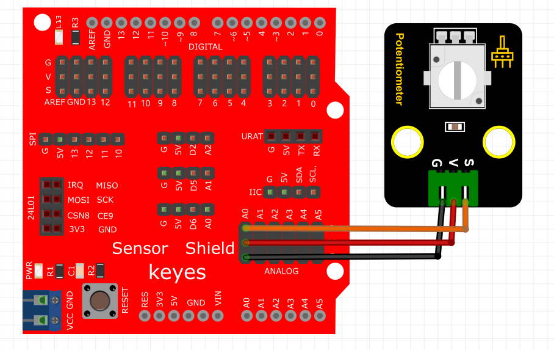
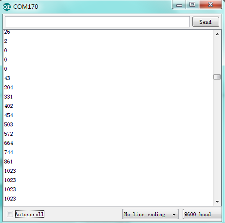

# Arduino


## 1. Arduino简介  

Arduino是一个开源电子原型平台，旨在简化电子项目的开发和编程。它由硬件和软件两部分组成，硬件包含各种兼容的开发板，软件则是Arduino IDE，允许用户编写、编辑和上传代码到Arduino板上。Arduino支持多种编程语言，尤其是C/C++，为用户提供丰富的库和示例，使初学者能够轻松入门，同时也能满足专业开发者的需求。Arduino广泛应用于各种项目，包括自动化控制、机器人、艺术装置等，适合教育、科研和自学。  

## 2. 连接图  

  

## 3. 测试代码  

```cpp  
int sensorPin = A0; // 定义模拟口A0  
int value = 0; // 设置value为0  

void setup() {  
    Serial.begin(9600); // 设置波特率  
}  

void loop() {  
    value = analogRead(sensorPin); // 将value设置为读取到的A0的数值  
    Serial.println(value, DEC); // 显示value数值，并自动换行  
    delay(100); // 延迟0.1S  
}  
```  

## 4. 测试结果  

按照上图接好线，烧录好代码，上电后，我们可以在软件的串口监视器中看到模拟口A0的模拟值，旋转旋钮，数据变化，变化范围在0-1023，如下图所示。  




