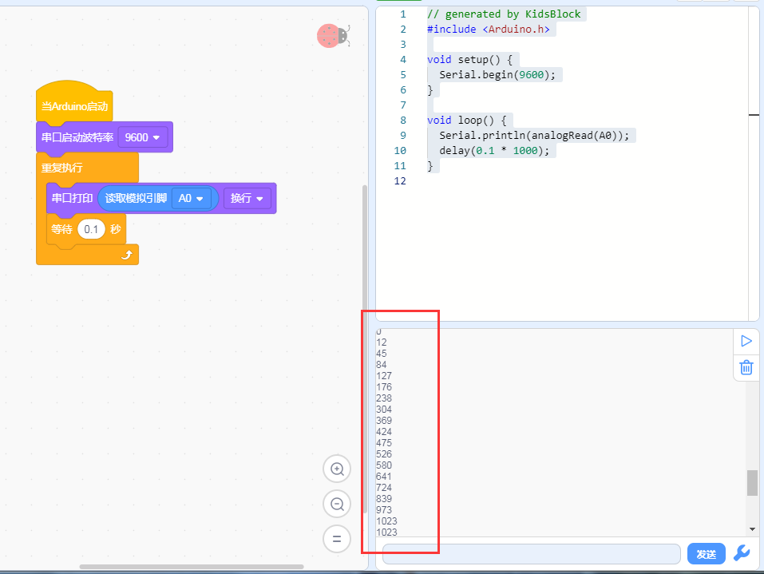

# KidsBlock

## 1. KidsBlock简介  

KidsBlock是一款面向儿童和初学者的图形化编程工具，旨在让编程变得简单和有趣。通过采用积木式的拖拽界面，用户可以轻松构建程序，而无需编写复杂的代码。KidsBlock支持与Arduino等硬件平台的集成，使用户能够开发各种电子项目，如机器人、传感器应用等。该工具不仅具备便捷的编程环境，还提供丰富的模块和支持，帮助学习者探索编程的乐趣和创造力，适合教育、娱乐和个人学习使用。  

## 2. 连接图  

  

## 3. 测试代码  

1. 在事件里拖出Arduino启动模块。  

     

2. 在串口栏拖出设置串口波特率模块并设置波特率为9600。  

     

3. 在控制栏拖出重复执行模块。  

     

4. 在串口栏拖出串口打印模块；在引脚栏拖出读取模拟引脚模块设置引脚为A0并添加到串口打印模块上。  

     

5. 在控制栏拖出延时模块并设置延时为100ms。  

     

## 4. 测试结果  

按照上图接好线，烧录好代码，上电后，我们可以在软件的串口监视器中看到模拟口A0的模拟值，旋转旋钮，数据变化，变化范围在0-1023，如下图所示。  

