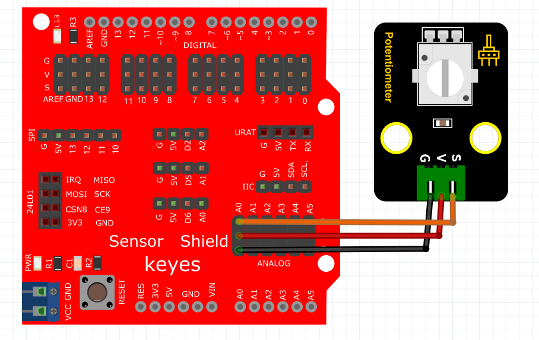

# Mixly

## 1. Mixly简介  

Mixly是一款图形化编程工具，专为初学者和儿童设计，旨在使编程变得简单、有趣。它采用积木式的拖放界面，用户可以通过组合不同的模块来创建程序，而无需编写复杂的代码。Mixly支持与多种硬件平台的接入，特别是与Arduino的结合，使得用户可以轻松进行电子项目的开发。该工具具备丰富的功能模块，适合于教育、娱乐和自学的场景，能够有效激发学习者的创造力和编程兴趣。  

## 2. 连接图  

  

## 3. 测试代码  

  

## 4. 测试结果  

按照上图接好线，烧录好代码，上电后，我们可以在软件的串口监视器中看到模拟口A0的模拟值，旋转旋钮，数据变化，变化范围在0-1023，如下图所示。  

