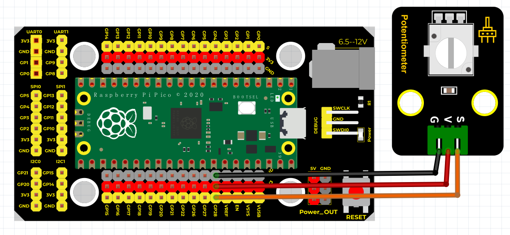
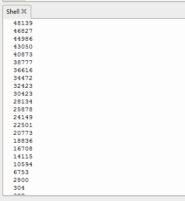

# Python


## 1. Python简介  

Python是一种广泛使用的高级编程语言，以其清晰的语法和可读性而著称。自1991年首次发布以来，Python已成为数据分析、人工智能、Web开发、科学计算等领域的主流语言。Python支持多种编程范式，包括面向对象和函数式编程，拥有丰富的第三方库和框架，使得开发者能够高效地构建应用程序。其简单的学习曲线使得Python非常适合初学者，同时其强大的功能也满足了经验丰富的开发者的需求。  

## 2. 连接图  

  

## 3. 测试代码  

```python  
import machine  
import utime  

analogPin = machine.ADC(28)  # 设置28脚为模拟信号  

while True:  
    reading = analogPin.read_u16()  # 读取模拟信号  
    print(reading)  # 打印模拟值  
    utime.sleep_ms(100)  # 延迟100毫秒  
```  

## 4. 测试结果  

按照上图接好线，烧录好代码，上电后，我们可以看到打印出来的模拟值，如下图所示。  




